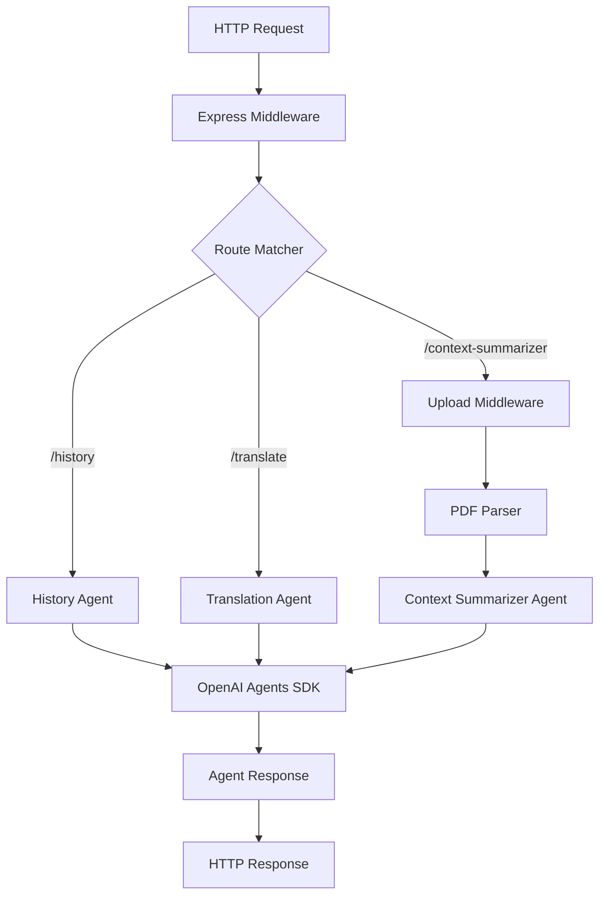

## Overview

AgentSpace is built on Express.js with a clean, modular architecture that separates concerns into distinct layers. The system follows a conventional project structure with clear separation between internal implementation and external entry points.

## Project Structure

AgentSpace organizes code into two main directories:

```
agentspace/
├── cmd/                    # Entry points and application bootstrap
├── source/
│   └── internal/          # Internal implementation
│       ├── agents/        # AI agent implementations
│       ├── router/        # Route definitions
│       ├── server/        # Server setup
│       └── common/        # Shared utilities
└── tmp/                   # Temporary file storage
```

### Directory Responsibilities

<CardGroup cols={2}>
  <Card title="cmd/" icon="play">
    Application entry points that bootstrap the server and start the application.
  </Card>
  <Card title="internal/" icon="folder-tree">
    Private implementation details not meant to be imported by external packages.
  </Card>
  <Card title="agents/" icon="robot">
    Specialized AI agent implementations using the OpenAI Agents SDK.
  </Card>
  <Card title="router/" icon="route">
    Express route definitions and endpoint configurations.
  </Card>
  <Card title="server/" icon="server">
    Express server initialization and middleware setup.
  </Card>
  <Card title="common/" icon="wrench">
    Shared utilities for logging, file handling, and parsing.
  </Card>
</CardGroup>

## Server Layer

### Express.js Setup

The server is initialized in `source/internal/server/server.ts:8-16` with essential middleware:

```typescript
import express from 'express';
import { agentRouter } from '../router/agents.js';
import { Logger } from '../common/logger.js';

const logger = new Logger('cmd/server');

export const initAgentspaceServer = () => {
  const app = express();

  // Built-in middleware
  app.use(express.json());
  app.use(express.urlencoded({ extended: true }));
  
  // Agent routes
  app.use(agentRouter[0], agentRouter[1]);
  
  logger.info('agentspace live at http://localhost:8090');
  return app;
};
```

### Middleware Stack

The server configures three layers of middleware:

1. **JSON parsing**: `express.json()` - Parses JSON request bodies
2. **URL-encoded parsing**: `express.urlencoded({ extended: true })` - Handles form submissions
3. **Route handling**: Custom agent router mounted at `/agents`

<Note>
  The router export pattern `[path, router]` allows for clean mounting: the first element is the base path (`/agents`), and the second is the Express Router instance.
</Note>

## Routing Layer

### Agent Router

Routes are defined in `source/internal/router/agents.ts:7-13` using Express Router:

```typescript
import express from 'express';
import { getHistoryPostHandler } from '../agents/history.js';
import { getTranslatedDataPostHandler } from '../agents/translate-agent.js';
import { getContextSummaryPostHandler } from '../agents/context-summarizer.js';
import { uploadMiddleware } from '../common/upload-file.js';

const router = express.Router();

router.get('/history', getHistoryPostHandler);
router.get('/translate', getTranslatedDataPostHandler);
router.post('/context-summarizer', uploadMiddleware, getContextSummaryPostHandler);

export const agentRouter: [string, express.Router] = ['/agents', router];
```

### Route Configuration

| Method | Path | Handler | Middleware |
|--------|------|---------|------------|
| GET | `/agents/history` | History Agent | None |
| GET | `/agents/translate` | Translation Agent | None |
| POST | `/agents/context-summarizer` | Context Summarizer | File upload |

<Info>
  The Context Summarizer route uses the `uploadMiddleware` to handle multipart form data before processing the request.
</Info>

## Common Utilities

### Logger

AgentSpace uses a custom logger built on the `debug` package (`source/internal/common/logger.ts:13-62`):

```typescript
import Debug from 'debug';

const globalContext = 'agentspace';

export enum LoggingLevel {
  INFO = 'INFO',
  ERROR = 'ERROR',
  DEBUG = 'DEBUG',
}

export class Logger {
  private logInfo: Debug.IDebugger;
  private logError: Debug.IDebugger;
  private logDebug: Debug.IDebugger;
  private loggingLevel: LoggingLevel;

  constructor(loggingContext: string) {
    this.logInfo = globalLogger.extend(':' + loggingContext + '::[INFO]');
    this.logError = globalLogger.extend(':' + loggingContext + '::[ERROR]');
    this.logDebug = globalLogger.extend(':' + loggingContext + '::[DEBUG]');
    this.loggingLevel = LoggingLevel.INFO;
  }

  public info = (arg: unknown, ...args: unknown[]): void => {
    if ([LoggingLevel.INFO, LoggingLevel.DEBUG].includes(this.loggingLevel)) {
      this.logInfo(arg, ...args);
    }
  };

  public error = (arg: unknown, ...args: unknown[]): void => {
    if ([LoggingLevel.ERROR, LoggingLevel.INFO, LoggingLevel.DEBUG].includes(this.loggingLevel)) {
      this.logError(arg, ...args);
    }
  };

  public setLoggingLevel(level: LoggingLevel): void {
    this.loggingLevel = level;
  }
}
```

#### Usage

```typescript
import { Logger } from '../common/logger.js';

const logger = new Logger('my-component');

logger.info('Server started successfully');
logger.error('Failed to process request', error);
```

### File Upload

File uploads are handled by `multer` middleware (`source/internal/common/upload-file.ts:5-35`):

```typescript
import multer from 'multer';
import path from 'path';

const storage = multer.diskStorage({
  destination: path.join(process.cwd(), 'tmp/'),
  filename: (req, file, cb) => {
    const uniqueName = `${file.fieldname}-${Date.now()}${path.extname(file.originalname)}`;
    cb(null, uniqueName);
  },
});

const upload = multer({
  storage,
  limits: { fileSize: 5 * 1024 * 1024 }, // 5MB limit
}).single('myFile');

export const uploadMiddleware = (req: Request, res: Response, next: NextFunction) => {
  upload(req, res, (err: any) => {
    if (err instanceof multer.MulterError) {
      if (err.code === 'LIMIT_FILE_SIZE') {
        return res.status(400).json({ error: 'File too large (max 5MB).' });
      }
      return res.status(400).json({ error: err.message });
    } else if (err) {
      return res.status(500).json({ error: 'File upload failed.' });
    }

    if (!req.file) {
      return res.status(400).json({ error: 'No file provided.' });
    }

    next();
  });
};
```

#### Upload Configuration

- **Storage**: Disk storage in `tmp/` directory
- **Filename**: `{fieldname}-{timestamp}.{ext}` for uniqueness
- **Size limit**: 5MB maximum
- **Field name**: Expects `myFile` as the form field

### PDF Parsing

PDF text extraction is handled by a simple wrapper around `pdf-parse` (`source/internal/common/parse.ts:4-9`):

```typescript
import { readFile } from 'fs/promises';
import { PDFParse, type TextResult } from 'pdf-parse';

export const parsePDFBuffer = async (filePath: string): Promise<TextResult | undefined> => {
  const fileBuffer = await readFile(filePath);
  const pdfData = await new PDFParse({ data: fileBuffer });
  const extractedText = pdfData.getText();
  return extractedText;
};
```

## Request/Response Flow

Here's how a typical request flows through AgentSpace:

<Steps>
  <Step title="Request arrives at Express server">
    The Express server receives an HTTP request on one of the agent endpoints.
  </Step>
  
  <Step title="Middleware processing">
    Built-in middleware parses JSON/URL-encoded body. For file uploads, `uploadMiddleware` handles multipart form data and saves files to `tmp/`.
  </Step>
  
  <Step title="Route matching">
    The router matches the request path to the appropriate agent handler based on the route configuration.
  </Step>
  
  <Step title="Input validation">
    The handler validates required inputs (question text, uploaded files, etc.) and returns 400 errors if validation fails.
  </Step>
  
  <Step title="File processing (if applicable)">
    For the Context Summarizer, the PDF is parsed using `parsePDFBuffer()` to extract text content.
  </Step>
  
  <Step title="Agent execution">
    The handler calls `run(agent, input)` from the OpenAI Agents SDK, which processes the input using the agent's instructions.
  </Step>
  
  <Step title="Response">
    The agent's output is returned in the response body. Temporary files are cleaned up in a `finally` block.
  </Step>
  
  <Step title="Error handling">
    Any errors during processing are caught and returned as 500 responses with appropriate error messages.
  </Step>
</Steps>

## Data Flow Diagram



## Design Patterns

### Module Pattern

Each component exports specific functions and types, maintaining clear boundaries:

```typescript
// Export only what's needed
export const uploadMiddleware = (req, res, next) => { ... };

// Keep implementation details private
const storage = multer.diskStorage({ ... });
```

### Handler Pattern

All route handlers follow a consistent structure:

1. Extract input from request
2. Validate input
3. Process request (with try-catch)
4. Return response or error

### Router Tuple Pattern

Routers are exported as `[path, router]` tuples for clean mounting:

```typescript
export const agentRouter: [string, express.Router] = ['/agents', router];

// Server can mount with spread operator
app.use(agentRouter[0], agentRouter[1]);
```

<Tip>
  This pattern makes it easy to mount multiple routers at different base paths without hardcoding paths in the server initialization.
</Tip>

## Extending the Architecture

### Adding New Routes

1. Create a handler in the appropriate directory:

```typescript
// source/internal/agents/new-agent.ts
export const getNewAgentHandler = async (req: Request, res: Response) => {
  // Implementation
};
```

2. Register the route in the router:

```typescript
// source/internal/router/agents.ts
import { getNewAgentHandler } from '../agents/new-agent.js';

router.get('/new-agent', getNewAgentHandler);
```

### Adding Middleware

Create middleware in `common/` and apply it to routes:

```typescript
// source/internal/common/auth.ts
export const authMiddleware = (req, res, next) => {
  // Auth logic
  next();
};

// Apply to routes
router.get('/protected', authMiddleware, handler);
```

### Adding Utilities

Place shared utilities in `common/` and import where needed:

```typescript
// source/internal/common/validation.ts
export const validateEmail = (email: string): boolean => {
  // Validation logic
};
```

<Warning>
  Keep the `internal/` directory truly internal. External packages should not import from this directory. Use a public API layer if you need to expose functionality.
</Warning>
